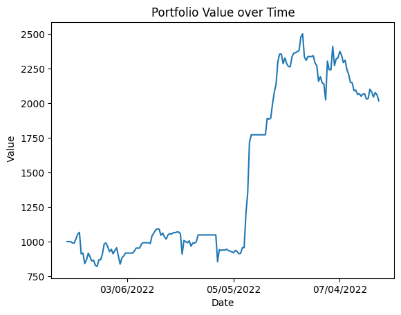
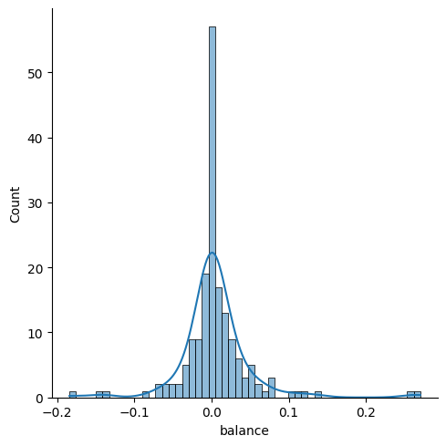

# Crypto Pairs Trading
### by Kevin Wang

During the summer after my sophomore year, I worked on a crytocurrency pairs trading project. Here is my work and my backtest results.

---
## Pairs Trading

Suppose we have two non-stationary time series $x_t$ and $y_t$. The two series are said to be cointegrated if the time series 

$$y_t - \beta x_t$$

is stationary for some value $\beta$. In other words, deviations from the long-run equilibrium are caused by white noise, and will be subsequently corrected in future time steps. Pairs trading exploits the mean-reverting behavior of cointegrated stocks. 

Suppose we have two assets $\mathbf{A}$ and $\mathbf{B}$. Let $\log{p_t^A}$ represent the log price of $\mathbf{A}$ at time $t$, and let $\log{p_t^B}$ be defined the same for $\mathbf{B}$. Logarithms are used because we care about the percent change of an asset, rather than absolute change. Now, consider a portfolio long one share of $\mathbf{A}$ and short $\beta$ shares of $\mathbf{B}$. We want to buy the portfolio (long $\mathbf{A}$ and short $\mathbf{B}$) when the time series is $\delta$ below the mean and sell the portfolio (sell $\mathbf{A}$ and buy $\mathbf{B}$) when the time series is $\delta$ above the mean in $i$ time steps.

$$
\begin{align}
    \log(p_{t}^A) - \beta \log(p_{t}^B) &= \mu - \delta \\
    \log(p_{t+i}^A) - \beta \log(p_{t+i}^B) &= \mu + \delta \\
\end{align}
$$

The profit on the trade is the change in the spread, $2\delta$. A major challenge is deciding the value of $\delta$. In practice, it is enough to set $\delta$ proportional to the spread's standard deviation (e.g. $\delta = 1.5 \sigma$).

---

## Data

To trade this strategy, we need price data. A price scraper is implemented in ```price_scraper.py```. It gets minute data starting January 1, 2022 up until the present. It can be set to run every minute for use in a paper or live trading strategy.

---

## Backtesting

A backtester is implemented in ```backtester.py```. It loads in prices gathered by ```price_scraper.py```, calculates the z-score of the current spread, and decides on the proper trade. Because I don't want someone else using my code, I have removed most of the logic from the backtester.

Below are the backtesting results of one particular pair of coins. But first, let's import any necessary packages:


```python
import numpy as np
import pandas as pd
import seaborn as sns
import matplotlib.pyplot as plt
import matplotlib.dates as mdates
```

Now, let's load in our backtest results:


```python
backtest = pd.read_csv("backtest-results.csv")
backtest = backtest.iloc[1:, :] # First row is a dummy row
backtest
```


<div>
<style scoped>
    .dataframe tbody tr th:only-of-type {
        vertical-align: middle;
    }

    .dataframe tbody tr th {
        vertical-align: top;
    }

    .dataframe thead th {
        text-align: right;
    }
</style>
<table border="1" class="dataframe">
  <thead>
    <tr style="text-align: right;">
      <th></th>
      <th>timestamp</th>
      <th>balance</th>
      <th>returns</th>
      <th>x_position</th>
      <th>y_position</th>
      <th>beta</th>
      <th>signal</th>
      <th>numtrades</th>
      <th>zscore</th>
    </tr>
  </thead>
  <tbody>
    <tr>
      <th>1</th>
      <td>2022-01-31 00:01:00</td>
      <td>1000.000000</td>
      <td>0.0</td>
      <td>0</td>
      <td>0.0</td>
      <td>1.535479</td>
      <td>0</td>
      <td>0</td>
      <td>-0.746549</td>
    </tr>
    <tr>
      <th>2</th>
      <td>2022-01-31 00:02:00</td>
      <td>1000.000000</td>
      <td>0.0</td>
      <td>0</td>
      <td>0.0</td>
      <td>1.535480</td>
      <td>0</td>
      <td>0</td>
      <td>-0.752089</td>
    </tr>
    <tr>
      <th>3</th>
      <td>2022-01-31 00:03:00</td>
      <td>1000.000000</td>
      <td>0.0</td>
      <td>0</td>
      <td>0.0</td>
      <td>1.535480</td>
      <td>0</td>
      <td>0</td>
      <td>-0.768799</td>
    </tr>
    <tr>
      <th>4</th>
      <td>2022-01-31 00:04:00</td>
      <td>1000.000000</td>
      <td>0.0</td>
      <td>0</td>
      <td>0.0</td>
      <td>1.535481</td>
      <td>0</td>
      <td>0</td>
      <td>-0.770753</td>
    </tr>
    <tr>
      <th>5</th>
      <td>2022-01-31 00:05:00</td>
      <td>1000.000000</td>
      <td>0.0</td>
      <td>0</td>
      <td>0.0</td>
      <td>1.535482</td>
      <td>0</td>
      <td>0</td>
      <td>-0.783967</td>
    </tr>
    <tr>
      <th>...</th>
      <td>...</td>
      <td>...</td>
      <td>...</td>
      <td>...</td>
      <td>...</td>
      <td>...</td>
      <td>...</td>
      <td>...</td>
      <td>...</td>
    </tr>
    <tr>
      <th>254874</th>
      <td>2022-07-26 23:54:00</td>
      <td>2056.045603</td>
      <td>0.0</td>
      <td>0</td>
      <td>0.0</td>
      <td>0.652490</td>
      <td>0</td>
      <td>43</td>
      <td>0.635702</td>
    </tr>
    <tr>
      <th>254875</th>
      <td>2022-07-26 23:55:00</td>
      <td>2056.045603</td>
      <td>0.0</td>
      <td>0</td>
      <td>0.0</td>
      <td>0.652513</td>
      <td>0</td>
      <td>43</td>
      <td>0.671246</td>
    </tr>
    <tr>
      <th>254876</th>
      <td>2022-07-26 23:56:00</td>
      <td>2056.045603</td>
      <td>0.0</td>
      <td>0</td>
      <td>0.0</td>
      <td>0.652538</td>
      <td>0</td>
      <td>43</td>
      <td>0.650625</td>
    </tr>
    <tr>
      <th>254877</th>
      <td>2022-07-26 23:57:00</td>
      <td>2056.045603</td>
      <td>0.0</td>
      <td>0</td>
      <td>0.0</td>
      <td>0.652561</td>
      <td>0</td>
      <td>43</td>
      <td>0.706399</td>
    </tr>
    <tr>
      <th>254878</th>
      <td>2022-07-26 23:58:00</td>
      <td>2056.045603</td>
      <td>0.0</td>
      <td>0</td>
      <td>0.0</td>
      <td>0.652583</td>
      <td>0</td>
      <td>43</td>
      <td>0.710188</td>
    </tr>
  </tbody>
</table>
<p>254878 rows × 9 columns</p>
</div>


As we can see, we have the balance of our portfolio taken every minute.  The starting balance was $1,000 and grew to $2,056 for a more than 100% gain.

Now, let's look at the daily value of our portfolio.


```python
# Get daily data
daily = backtest.iloc[0::1440, :] # select every 1440'th row (because there are 1440 minutes in a day)

# Define x-axis
x_axis = pd.date_range(start="2022-01-31", end="2022-07-26", freq="D")

# Plot daily portfolio value
plt.gca().xaxis.set_major_formatter(mdates.DateFormatter('%m/%d/%Y'))
plt.gca().xaxis.set_major_locator(mdates.DayLocator(interval=60))
plt.plot(x_axis, daily["balance"])
plt.title("Portfolio Value over Time")
plt.xlabel("Date")
plt.ylabel(" Value")
plt.show()
```


    

    


---

## Sharpe Ratio

The Sharpe ratio evaluates the relationship between risk assumed and return for an asset. It is defined as

$$
\text{Sharpe Ratio} = \frac{\text{Mean portfolio return} - \text{Risk-free rate}}{\text{Standard deviation of portfolio returns}}
$$

Let's compute the annualized Sharpe ratio of the backtest. It is defined as:

$$
\text{Annualized Sharpe Ratio} = \frac{\text{Average daily return} - \text{Risk-free rate}}{\text{Standard deviation of daily returns}} * \sqrt{\text{Number of days}}
$$

Here I will assume a risk-free rate of $0\%$. The Sharpe ratio is computed below:


```python
# Get daily returns
daily_returns = daily['balance'].pct_change()

# Define risk-free rate
risk_free_rate = 0

# Compute Sharpe
sharpe = (np.mean(daily_returns) - risk_free_rate) / np.std(daily_returns) * np.sqrt(len(daily_returns))
print(sharpe)
```

    1.441061697046876
    

---

## Distribution of Returns

Using the seaborn package, we can plot the distribution of daily returns returns:


```python
q25, q75 = np.nanpercentile(daily_returns, [25, 75])
bin_width = 2 * (q75 - q25) * len(daily_returns) ** (-1/3)
bins = round((daily_returns.max() - daily_returns.min()) / bin_width)

sns.displot(daily_returns, bins=bins, kde=True)
```


    <seaborn.axisgrid.FacetGrid at 0x1fa1b63bed0>


    

    

